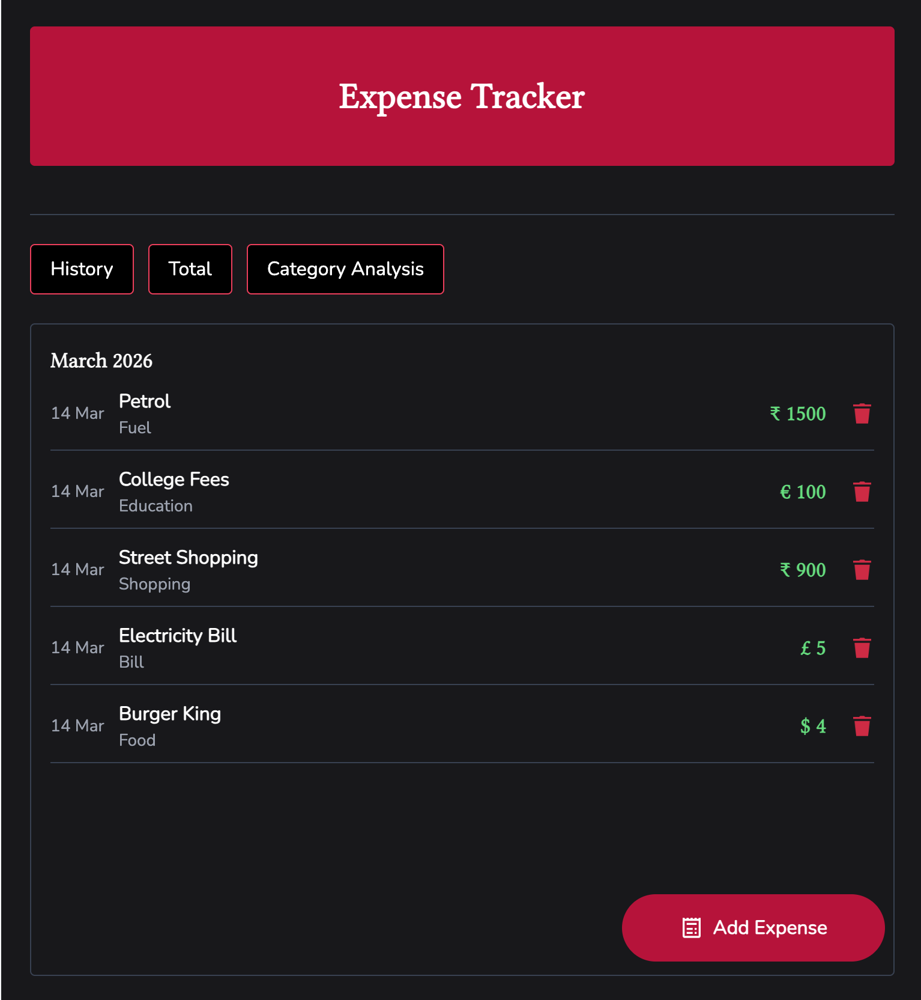
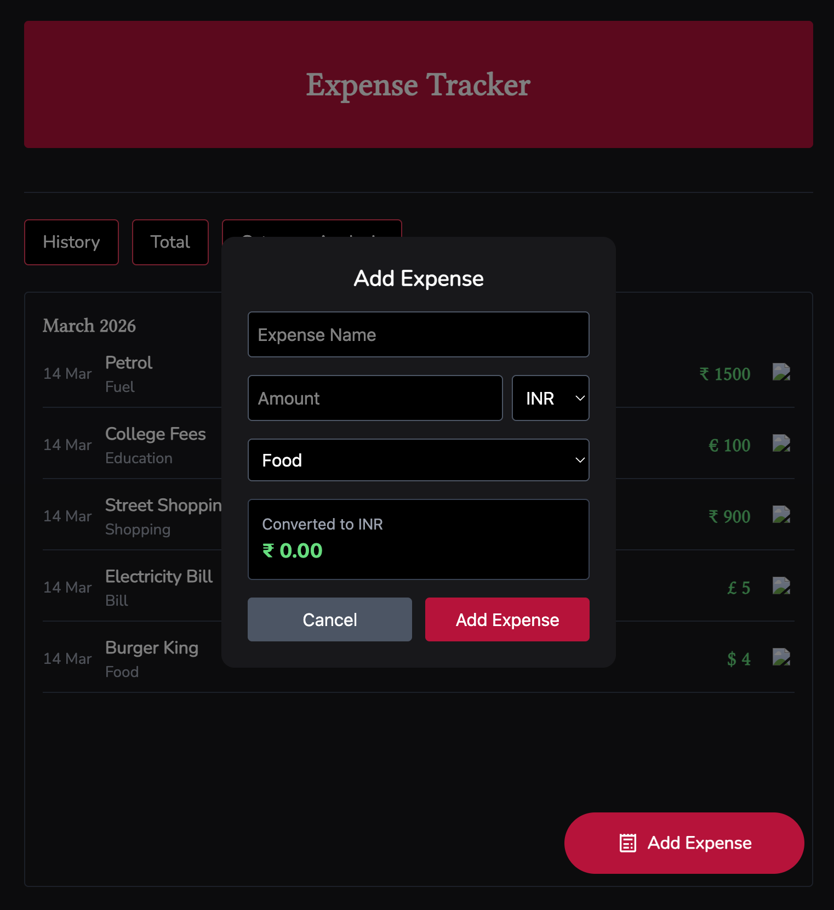
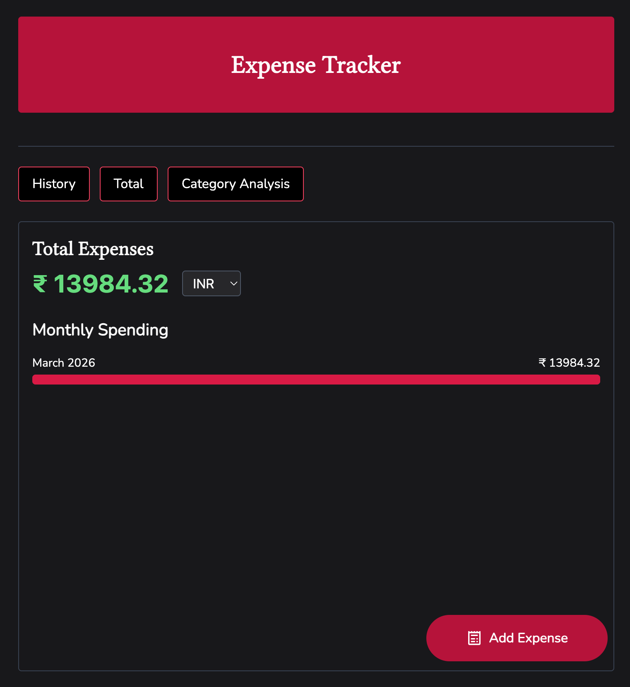
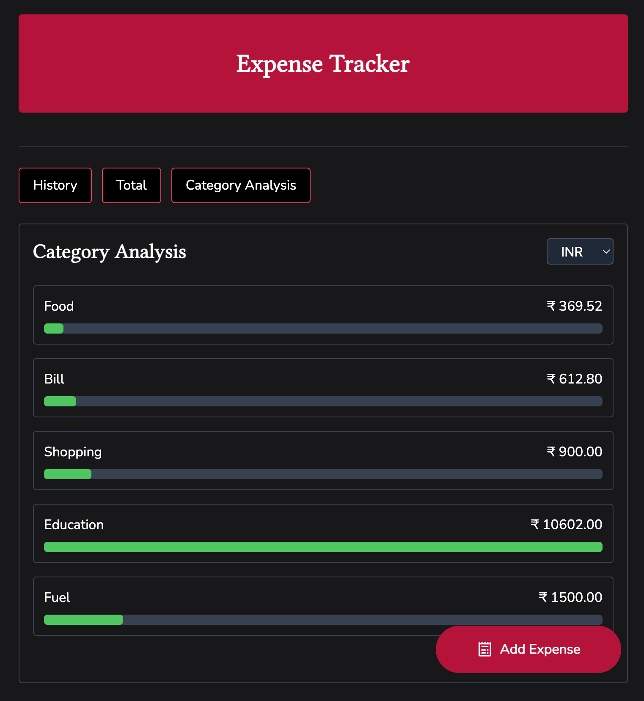

# 💰 SpendWise – React Expense Tracker

SpendWise is a modern React-based expense tracking web application that helps users record, manage, and analyze their daily spending habits. The application allows users to add expenses, organize them by category, and visualize spending insights through charts and category analysis.

Users can also view their total expenses in multiple currencies using real-time exchange rates, making it easier to understand spending globally.

---

## 🚀 Features

- ➕ Add daily expenses with name, amount, category, and currency
- 📜 View expense history grouped by month
- ❌ Delete expenses instantly
- 💰 Automatic total expense calculation
- 📊 Monthly spending visualization using bar graphs
- 🧾 Category-wise expense analysis
- 🌍 Currency conversion (USD, EUR, GBP)
- 💾 Data persistence using LocalStorage
- ⚡ Clean and responsive UI built with Tailwind CSS

---

## 🧠 What I Learned

This project helped me strengthen my understanding of important frontend concepts:

- React component architecture
- React Hooks (`useState`, `useEffect`)
- State management in React
- API integration for currency conversion
- Data persistence using LocalStorage
- Creating reusable UI components
- Building data visualizations for financial insights
- Tailwind CSS for rapid UI development

---

## 🛠️ Tech Stack

- React
- JavaScript (ES6)
- Tailwind CSS
- Exchange Rate API
- LocalStorage

---

## 📸 Screenshots

### 📜 Expense History


### ➕ Add Expense


### 💰 Total Expense Analysis


### 📊 Category Analysis


---

## ⚙️ Installation

Clone the repository

```
git clone https://github.com/yourusername/spendwise-expense-tracker.git
```

Navigate into project folder

```
cd spendwise-expense-tracker
```

Install dependencies

```
npm install
```

Run the development server

```
npm run dev
```

Open the browser

```
http://localhost:5173
```

---

## 🔮 Future Improvements

- ✏️ Edit expense functionality
- ☁️ Cloud database storage
- 📈 Advanced financial analytics
- 📤 Export expense reports

